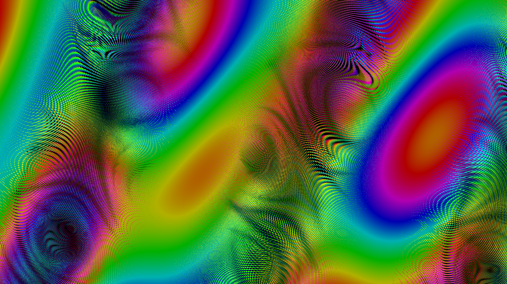
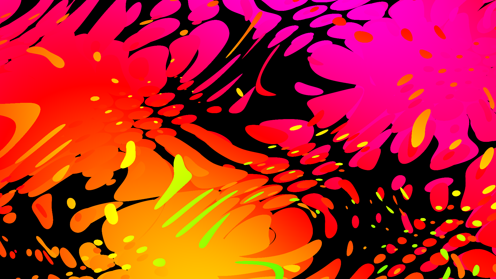
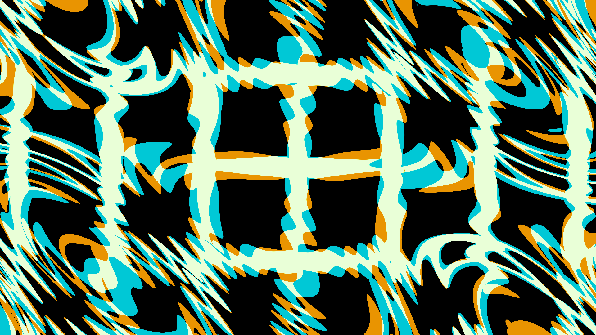

# Moiré Exploré

An interactive web application for creating, animating, and sharing mesmerizing moiré pattern visualizations.

**Live Demo:** [via GitHub Pages](https://nateroe.github.io/moire/)

## Overview

Moiré Exploré is a powerful WebGL-based creative tool that generates dynamic moiré patterns by overlapping grid layers with wave perturbations. The app features a comprehensive set of controls allowing users to create complex visual patterns, animate them using a simple keyframe system, and share their creations with others through an efficient URL state encoding system.

## Features

This project includes the following features:

#### Core Pattern Generation
* **Blending Modes**: Multiple blending modes (additive, overlay, multiply, screen, etc.)
* **Grid Types**: Support for both rectangular and hexagonal grid patterns
* **Moiré Pattern Generation**: Core grid-based pattern system with multiple overlapping grid layers
* **Rendering Style**: Option to render grids as lines or dots
* **Wave Perturbations**: Dynamic wave effects that distort grid patterns
* **Wave Types**: Multiple wave types (transverse, longitude, amplitude, hue, saturation, lightness, rotation, phase shift)

#### Animation & Rendering
* **Animation System**: Keyframe-based animation between two states (K1 and K2)
* **Fullscreen Mode**: High-resolution presentation mode with keyboard controls
* **Multi-Canvas Rendering System**: Manages shared WebGL context across multiple canvases, saving resources and init time
* **Rendering Engine**: WebGL-based real-time rendering with optimized shader for smooth performance
* **Visibility Management**: Intelligently pauses animations when tab or canvas is not visible to save resources

#### User Interface & Controls
* **Color Control**: HSV color picker for detailed color customization
* **Common Parameter Controls**: Common controls that affect all grids or waves at once
* **Direction Controls**: Visual angle control for wave propagation
* **Double-click Parameter Reset**: Quick reset of sliders
* **Drag and Drop**: Reorder grids and waves via drag handles
* **Grid/Wave Active Toggles**: Individual enable/disable controls for each grid and wave
* **Mini Canvas**: Picture-in-picture view when scrolling away from main canvas
* **Responsive Design**: UI adapts to different screen sizes, with specific mobile optimizations, theoretically usable on your phone
* **Tooltips**: Contextual help throughout the interface

#### Data Management & Sharing
* **Binary State Encoding**: Efficient format for saving/sharing complex states via URL
* **Favorites System**: Save favorites to local storage, view and manage favorites on a gallery page
* **Parameter Autosave**: Automatic saving of settings to localStorage (local storage uses JSON)
* **State Sharing**: Generates compact URL encoding for sharing created patterns
* **State Versioning**: Backward compatibility for older state data formats
* **User Preferences System**: Remembers settings like tooltip visibility

#### Content & Help
* **Comprehensive Help System**: In-app documentation in addition to contextual tooltips
* **Pattern Gallery**: Showcase of example patterns with embedded previews

#### Export & Streaming
* **Render to Disk**: Export custom PNG image sequence
* **Streaming Capability**: Red5 Pro integration to stream patterns live

#### Tools & Utilities
* **Phase Modulation**: Complex interaction between waves via phase shift
* **Random Generation**: Randomize buttons for quick wave exploration
* **Randomization Tools**: One-click randomization of wave parameters

#### Technical Features
* **Offline Functionality**: Works without internet connection
* **Self-contained Architecture**: No external dependencies for core functionality

## Screenshots

## Usage

### Basic Controls
* Use the grid controls to set up your base pattern
* Add wave perturbations to create dynamic effects
* Experiment with different blending modes and color settings

### Creating Animations
* Set up your first keyframe (K1)
* Switch to the second keyframe (K2) and modify parameters
* Press Play to animate between states
* Adjust duration and animation mode as needed

### Saving & Sharing
* Save interesting patterns to your favorites
* Use the "Generate Share Link" button to create a URL that contains your pattern
* Export PNG sequences for use in video editing software

### Tips for Beginners
* Start with the gallery examples to understand possibilities
* Use the randomize buttons to discover interesting wave combinations
* Use **Active** checkbox to disable grids and waves to understand their contribution
* Tooltips provide context-sensitive help throughout the interface
* Consult the built-in help system for detailed information

### To Create Seamless Loops

To create a seamless loop, both K1 and K2 must appear identical. However if they are actually both identical, then no animation will occur. Hrm.

The solution is to recognize that certain parameters are cyclical and return to the same value every 360°:
* Common Hue Rotation
* An individual grid's Hue angle (edit grid color, in the popup adjust hue angle +/-360)
* Common Phase Offset
* Common Direction Offset
* An individual wave's Phase

## Installation

This application runs entirely in the browser and requires no server-side installation.

**Recommended: Server Deployment** For best results, deploy to any web server (even a simple static file server). This ensures all features work correctly, including favorites, file operations, and browser security features.

**Local Development (with limitations)** You can run locally by opening index.html in a modern web browser, but some features may not work due to browser security restrictions on file:// URLs. Consider using a local development server like Python's http.server or Node's http-server instead.

For production deployment, simply copy all files to any web server.

## Browser Compatibility

Moiré Exploré requires a browser with good WebGL support. Developed and tested with recent Chrome and Firefox, but should work on other modern browsers with WebGL support.

## Dependencies

* [Red5 Pro WebRTC SDK](https://www.red5pro.com/docs/development/webrtc/overview/) - Used for streaming capabilities

## License

This project is licensed under the [GNU General Public License v3.0](https://www.gnu.org/licenses/gpl-3.0.en.html) - see the [LICENSE](LICENSE) file for details.

Commercial licensing available, contact author.

## Copyright

© 2025 Nate Roe. All rights reserved.

---

*Moiré Exploré was created as a tool for digital artists, educators, and anyone interested in exploring the fascinating world of moiré pattern physics and visual mathematics.*
